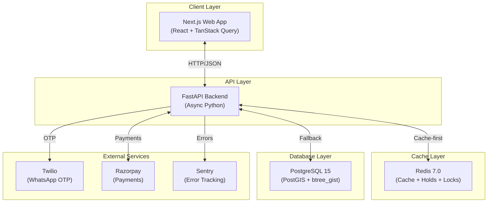
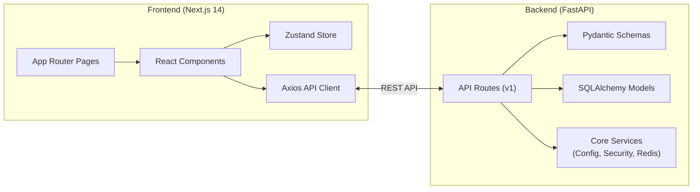
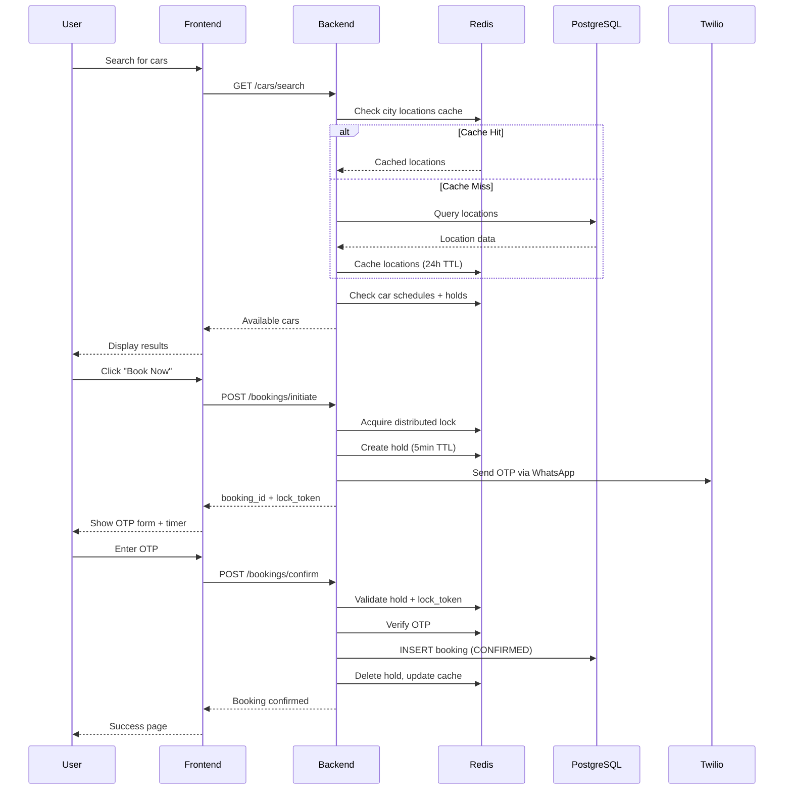
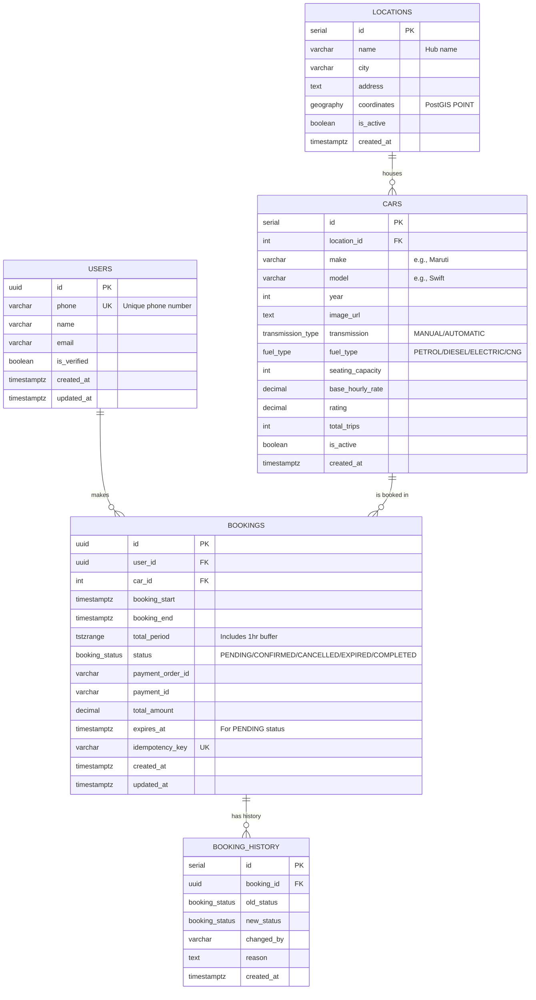
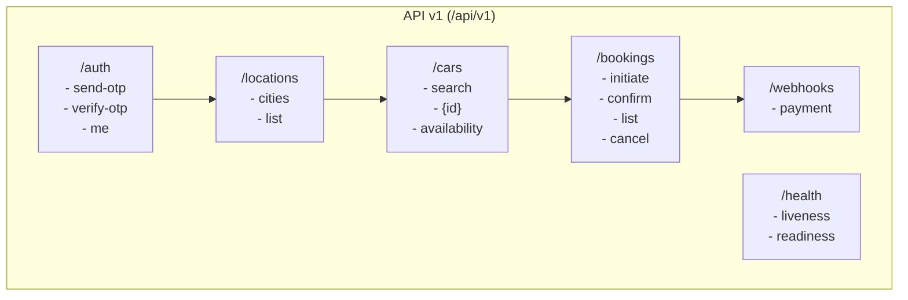
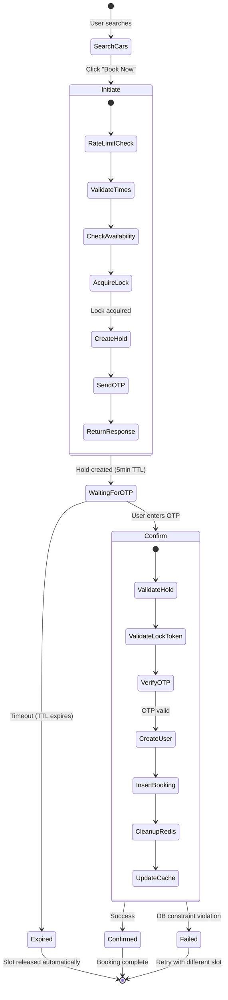
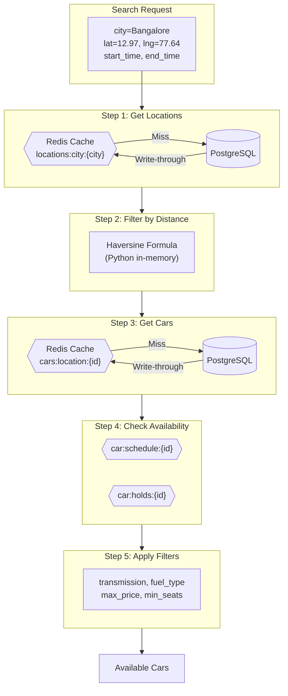
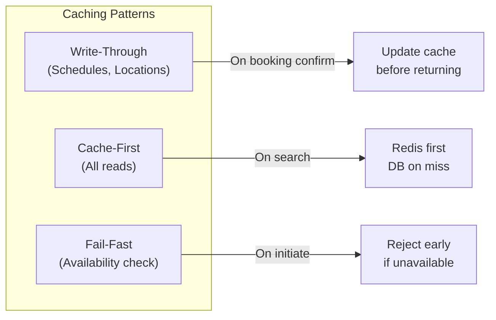
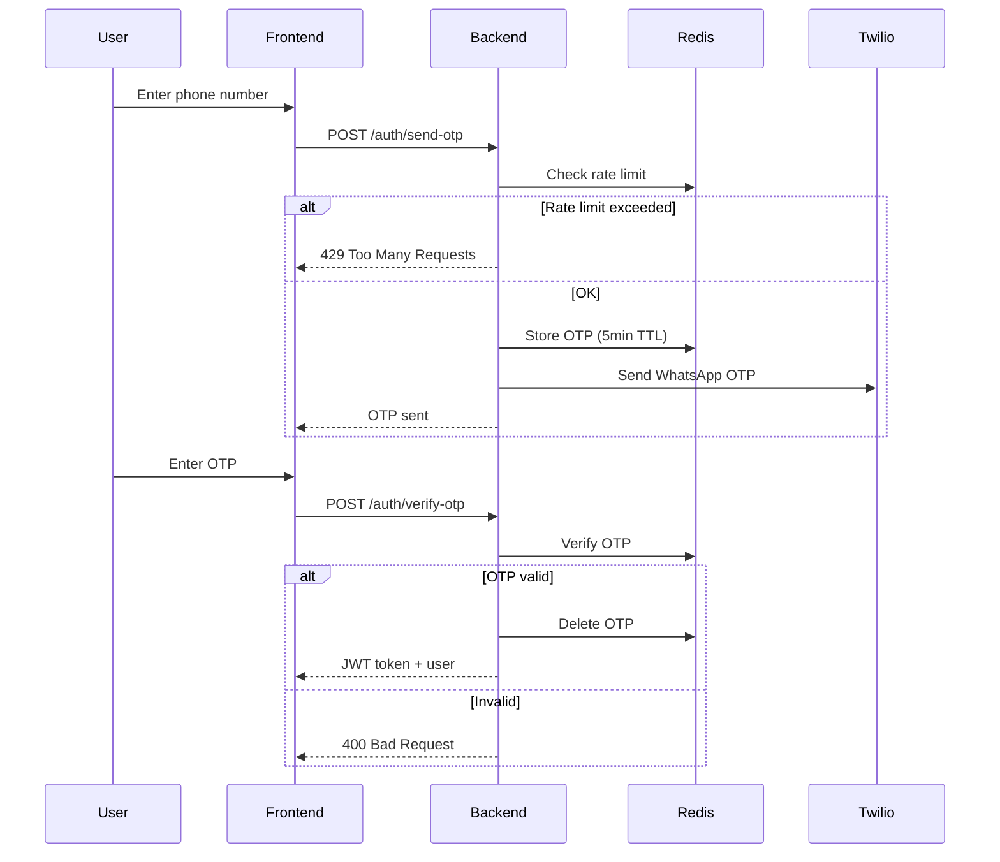
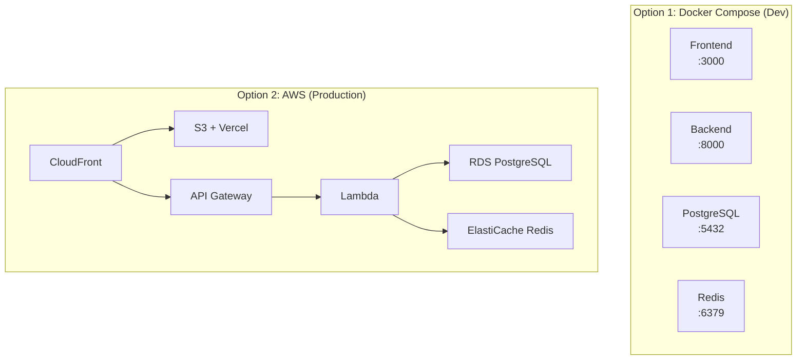

# ZoomCars - Production-Ready Self-Drive Car Rental Platform

A full-stack, production-ready car rental platform built with modern technologies. Features zero double-booking guarantees, OTP-based authentication, geo-spatial search, and a Redis-first booking hold system.

---

## Table of Contents

1. [System Overview](#system-overview)
2. [Architecture](#architecture)
3. [Tech Stack](#tech-stack)
4. [Database Design](#database-design)
5. [API Design](#api-design)
6. [Booking Flow](#booking-flow)
7. [Search System](#search-system)
8. [Caching Strategy](#caching-strategy)
9. [Security](#security)
10. [Deployment](#deployment)
11. [Getting Started](#getting-started)
12. [API Reference](#api-reference)

---

## System Overview

ZoomCars is a self-drive car rental platform designed for the Indian market. Users can search for available cars near their location, book them with OTP verification, and complete the rental process entirely through the platform.

### Key Features

| Feature | Description |
|---------|-------------|
| 🔐 **OTP Authentication** | Phone-based login via WhatsApp OTP (Twilio) |
| 🗺️ **Geo-Spatial Search** | Find cars within radius using PostGIS |
| 🚫 **Zero Double Bookings** | PostgreSQL exclusion constraints guarantee slot integrity |
| ⏱️ **5-Minute Hold System** | Redis-only holds with auto-expiry for abandoned bookings |
| 💰 **Dynamic Pricing** | Surge pricing for weekends, discounts for long-term rentals |
| 🔄 **Real-time Availability** | Write-through cache keeps availability data fresh |
| 📱 **Responsive UI** | Next.js with Tailwind CSS for all device sizes |

### Business Rules

- **Minimum rental**: 1 hour
- **Buffer time**: 1 hour between bookings (for cleaning)
- **Hold duration**: 5 minutes to complete OTP verification
- **OTP rate limit**: 3 requests per phone per hour
- **Search radius**: 15 km default

---

## Architecture

### High-Level Architecture



### Component Architecture



### Request Flow



---

## Tech Stack

### Backend

| Technology | Purpose | Version |
|------------|---------|---------|
| **FastAPI** | Web framework | Latest |
| **Python** | Runtime | 3.11+ |
| **SQLAlchemy** | Async ORM | 2.0+ |
| **Pydantic** | Data validation | 2.0+ |
| **PostgreSQL** | Primary database | 15+ |
| **PostGIS** | Geo-spatial extension | 3.3+ |
| **Redis** | Cache + Locks + Holds | 7.0+ |
| **Twilio** | WhatsApp OTP | - |
| **Razorpay** | Payment gateway | - |

### Frontend

| Technology | Purpose | Version |
|------------|---------|---------|
| **Next.js** | React framework | 14+ |
| **React** | UI library | 18+ |
| **TanStack Query** | Data fetching | 5+ |
| **Zustand** | State management | 4+ |
| **Tailwind CSS** | Styling | 3+ |
| **Axios** | HTTP client | 1+ |

### Infrastructure

| Technology | Purpose |
|------------|---------|
| **Docker** | Containerization |
| **Docker Compose** | Local orchestration |
| **AWS Lambda** | Serverless deployment |
| **Serverless Framework** | Lambda IaC |

---

## Database Design

### Entity Relationship Diagram



### Key Constraints

#### Double-Booking Prevention (Exclusion Constraint)

```sql
-- PostgreSQL exclusion constraint using btree_gist
CONSTRAINT no_double_booking EXCLUDE USING GIST (
    car_id WITH =,
    total_period WITH &&
) WHERE (status IN ('CONFIRMED', 'PENDING'))
```

This constraint **guarantees at the database level** that no two active bookings for the same car can have overlapping time periods.

#### Buffer Time

Each booking's `total_period` includes a 1-hour buffer after drop-off:

```sql
total_period = tstzrange(
    booking_start,
    booking_end + INTERVAL '1 hour',
    '[)'  -- Start-inclusive, end-exclusive
)
```

### Indexes

| Index | Purpose |
|-------|---------|
| `idx_locations_geo` | GiST index for geo-spatial queries |
| `idx_locations_city` | City-based location lookup |
| `idx_cars_location` | Cars by location |
| `idx_bookings_period` | GiST index for time range queries |
| `idx_bookings_user` | User booking history |
| `idx_bookings_idempotency` | Idempotent request handling |

---

## API Design

### API Architecture



### Endpoint Summary

| Endpoint | Method | Auth | Description |
|----------|--------|------|-------------|
| `/auth/send-otp` | POST | ❌ | Send OTP to phone |
| `/auth/verify-otp` | POST | ❌ | Verify OTP, get JWT |
| `/auth/me` | GET | ✅ | Get current user |
| `/locations/cities` | GET | ❌ | List available cities |
| `/cars/search` | GET | ❌ | Search available cars |
| `/cars/{id}` | GET | ❌ | Get car details |
| `/bookings/initiate` | POST | ❌ | Start booking, get hold |
| `/bookings/confirm` | POST | ❌ | Confirm with OTP |
| `/bookings` | GET | ✅ | List user bookings |
| `/webhooks/payment` | POST | ❌ | Razorpay webhook |

---

## Booking Flow

### Two-Step Booking Architecture

The booking system uses a **Redis-only hold pattern** to minimize database writes for abandoned bookings.



### Hold Data Structure

```json
{
  "booking_id": "uuid",
  "car_id": 123,
  "phone": "+919876543210",
  "start": "2024-02-01T10:00:00+05:30",
  "end": "2024-02-01T19:00:00+05:30",
  "lock_token": "uuid",
  "total_amount": 1592.00,
  "car_details": {
    "make": "Maruti",
    "model": "Swift",
    "year": 2023,
    "booking_start": "...",
    "booking_end": "..."
  },
  "created_at": "...",
  "expires_at": "..."
}
```

### Why Redis-Only Holds?

| Approach | DB Writes on Abandon | Cleanup Needed | Complexity |
|----------|---------------------|----------------|------------|
| **DB PENDING → EXPIRED** | ✅ Yes | ✅ Background job | High |
| **Redis Hold (our approach)** | ❌ No | ❌ TTL auto-expires | Low |

Benefits:
- Zero database pollution from abandoned bookings
- Instant slot release via TTL
- No background cleanup jobs needed
- Lower DB load during high traffic

---

## Search System

### City-Based Caching Architecture



### Cache Hierarchy

| Level | Key Pattern | TTL | Data |
|-------|-------------|-----|------|
| L1 | `locations:city:{city}` | 24h | All locations in city |
| L2 | `cars:location:{id}` | 1h | All cars at location |
| L3 | `car:schedule:{id}` | 1h | Confirmed booking periods |
| L4 | `car:holds:{id}` | 1h | Active hold IDs |
| L5 | `hold:{booking_id}` | 5m | Individual hold data |

### Zero-DB-Hit Path

When caches are warm:
1. ✅ Locations from Redis
2. ✅ Cars from Redis (batch MGET)
3. ✅ Schedules from Redis
4. ✅ Holds from Redis

**Result**: Complete search query without any database access.

---

## Caching Strategy

### Cache Patterns Used



### Redis Key Reference

| Key | Type | TTL | Purpose |
|-----|------|-----|---------|
| `config:cities` | String (JSON) | 24h | List of active cities |
| `locations:city:{city}` | String (JSON) | 24h | Locations in a city |
| `cars:location:{id}` | String (JSON) | 1h | Cars at a location |
| `car:schedule:{id}` | String (JSON) | 1h | Confirmed bookings |
| `hold:{booking_id}` | String (JSON) | 5m | Booking hold data |
| `car:holds:{car_id}` | Set | 1h | Active hold IDs for a car |
| `user:otp:{phone}` | String | 5m | OTP code |
| `otp_rate_limit:{phone}` | String | 1h | OTP rate limit counter |
| `booking:lock:{car_id}` | Lock | 30s | Distributed lock |
| `idempotency:{key}` | String (JSON) | 10m | Idempotency response |

---

## Security

### Authentication Flow



### JWT Token Structure

```json
{
  "user_id": "uuid",
  "phone": "+919876543210",
  "iat": 1704067200,
  "exp": 1706659200
}
```

- **Algorithm**: HS256
- **Expiry**: 30 days
- **Storage**: Frontend Zustand store (persisted to localStorage)

### Security Measures

| Layer | Protection |
|-------|------------|
| **Transport** | HTTPS only in production |
| **Auth** | JWT with secure secret |
| **API** | Rate limiting per IP/user |
| **OTP** | 5-minute expiry, 3/hour limit |
| **Booking** | Distributed locks prevent races |
| **Webhook** | HMAC signature verification |
| **Database** | Exclusion constraint (final safety) |

---

## Deployment

### Architecture Options



### Environment Variables

#### Backend

| Variable | Description | Required |
|----------|-------------|----------|
| `DATABASE_URL` | PostgreSQL connection string | ✅ |
| `REDIS_URL` | Redis connection string | ✅ |
| `SECRET_KEY` | JWT signing key | ✅ |
| `RAZORPAY_KEY_ID` | Razorpay API key | ✅ |
| `RAZORPAY_KEY_SECRET` | Razorpay secret | ✅ |
| `RAZORPAY_WEBHOOK_SECRET` | Webhook signature key | ✅ |
| `TWILIO_ACCOUNT_SID` | Twilio account | ✅ |
| `TWILIO_AUTH_TOKEN` | Twilio auth token | ✅ |
| `TWILIO_WHATSAPP_FROM` | WhatsApp sender | ✅ |
| `TWILIO_CONTENT_SID` | OTP template ID | ✅ |
| `SENTRY_DSN` | Sentry error tracking | ❌ |
| `CORS_ORIGINS` | Allowed origins | ✅ |

#### Frontend

| Variable | Description | Required |
|----------|-------------|----------|
| `NEXT_PUBLIC_API_URL` | Backend API URL | ✅ |
| `NEXT_PUBLIC_RAZORPAY_KEY_ID` | Razorpay public key | ✅ |

---

## Getting Started

### Prerequisites

- Docker & Docker Compose
- Node.js 20+ (for frontend dev)
- Python 3.11+ (for backend dev)

### Quick Start with Docker

```bash
# Clone the repository
git clone https://github.com/yourusername/zoomcars.git
cd zoomcars

# Start all services
docker-compose up -d

# Services will be available at:
# - Frontend: http://localhost:3000
# - Backend:  http://localhost:8000
# - API Docs: http://localhost:8000/api/docs
# - Adminer:  http://localhost:8080
```

### Local Development

#### Backend

```bash
cd backend

# Create virtual environment
python -m venv venv
source venv/bin/activate  # or venv\Scripts\activate on Windows

# Install dependencies
pip install -r requirements.txt

# Set environment variables
cp .env.example .env
# Edit .env with your credentials

# Run development server
uvicorn app.main:app --reload --port 8000
```

#### Frontend

```bash
cd frontend

# Install dependencies
npm install

# Set environment variables
cp .env.example .env.local
# Edit .env.local

# Run development server
npm run dev
```

#### Database Setup

```bash
# Connect to PostgreSQL and run schema
psql -h localhost -U postgres -d zoomcar -f database/schema.sql
```

---

## API Reference

### Authentication

#### Send OTP

```http
POST /api/v1/auth/send-otp
Content-Type: application/json

{
  "phone": "+919876543210"
}
```

**Response:**
```json
{
  "message": "OTP sent successfully",
  "expires_in_seconds": 300
}
```

#### Verify OTP

```http
POST /api/v1/auth/verify-otp
Content-Type: application/json

{
  "phone": "+919876543210",
  "otp": "123456"
}
```

**Response:**
```json
{
  "access_token": "eyJ...",
  "token_type": "bearer",
  "user": {
    "id": "uuid",
    "phone": "+919876543210",
    "name": null,
    "email": null
  }
}
```

### Cars

#### Search Cars

```http
GET /api/v1/cars/search?city=Bangalore&lat=12.97&lng=77.64&start_time=2024-02-01T10:00:00+05:30&end_time=2024-02-01T18:00:00+05:30
```

**Query Parameters:**

| Parameter | Type | Required | Description |
|-----------|------|----------|-------------|
| `city` | string | ✅ | City name |
| `lat` | float | ✅ | User latitude |
| `lng` | float | ✅ | User longitude |
| `start_time` | datetime | ✅ | Pickup time (ISO 8601) |
| `end_time` | datetime | ✅ | Drop-off time (ISO 8601) |
| `transmission` | string | ❌ | MANUAL or AUTOMATIC |
| `fuel_type` | string | ❌ | PETROL, DIESEL, ELECTRIC, CNG |
| `max_price` | float | ❌ | Max hourly rate |
| `min_seats` | int | ❌ | Minimum seats |
| `limit` | int | ❌ | Results limit (default: 20) |
| `offset` | int | ❌ | Pagination offset |

**Response:**
```json
{
  "cars": [
    {
      "id": 1,
      "make": "Maruti",
      "model": "Swift",
      "year": 2023,
      "image_url": "https://...",
      "transmission": "MANUAL",
      "fuel_type": "PETROL",
      "seating_capacity": 5,
      "base_hourly_rate": 99.00,
      "dynamic_price": 118.80,
      "rating": 4.5,
      "total_trips": 150,
      "distance_km": 2.3,
      "location": {
        "name": "Indira Nagar Metro",
        "city": "Bangalore",
        "address": "100 Feet Road..."
      }
    }
  ],
  "total_count": 15
}
```

### Bookings

#### Initiate Booking

```http
POST /api/v1/bookings/initiate
Content-Type: application/json

{
  "car_id": 1,
  "phone": "+919876543210",
  "start_time": "2024-02-01T10:00:00+05:30",
  "end_time": "2024-02-01T18:00:00+05:30"
}
```

**Response:**
```json
{
  "booking_id": "uuid",
  "lock_token": "uuid",
  "expires_at": "2024-02-01T09:55:00+05:30",
  "expires_in_seconds": 300,
  "otp_sent": true,
  "booking_preview": {
    "car": "Maruti Swift (2023)",
    "duration_hours": 8.0,
    "total_amount": 950.40,
    "start_time": "2024-02-01T10:00:00+05:30",
    "end_time": "2024-02-01T18:00:00+05:30"
  }
}
```

#### Confirm Booking

```http
POST /api/v1/bookings/confirm
Content-Type: application/json

{
  "booking_id": "uuid",
  "lock_token": "uuid",
  "otp": "123456",
  "name": "John Doe",
  "email": "john@example.com"
}
```

**Response:**
```json
{
  "booking_id": "uuid",
  "status": "CONFIRMED",
  "total_amount": 950.40,
  "message": "Booking confirmed successfully!",
  "car_details": {
    "make": "Maruti",
    "model": "Swift",
    "year": 2023,
    "image_url": "https://..."
  },
  "booking_start": "2024-02-01T10:00:00+05:30",
  "booking_end": "2024-02-01T18:00:00+05:30"
}
```

---

## Project Structure

```
zoomcars/
├── backend/
│   ├── app/
│   │   ├── api/v1/           # API endpoints
│   │   │   ├── auth.py       # Authentication
│   │   │   ├── bookings.py   # Booking flow
│   │   │   ├── cars.py       # Car search
│   │   │   ├── locations.py  # Location data
│   │   │   ├── webhooks.py   # Payment webhooks
│   │   │   └── health.py     # Health checks
│   │   ├── core/             # Core services
│   │   │   ├── config.py     # Configuration
│   │   │   ├── database.py   # DB connection
│   │   │   ├── redis.py      # Redis + CacheManager
│   │   │   └── security.py   # JWT utilities
│   │   ├── models/           # SQLAlchemy models
│   │   │   └── models.py     # User, Car, Booking, etc.
│   │   ├── schemas/          # Pydantic schemas
│   │   │   └── schemas.py    # Request/Response models
│   │   └── jobs/             # Background jobs
│   ├── tests/                # Pytest tests
│   ├── lambda_handler.py     # AWS Lambda entry
│   ├── requirements.txt
│   ├── serverless.yml        # Serverless Framework
│   └── Dockerfile
├── frontend/
│   ├── src/
│   │   ├── app/              # Next.js App Router
│   │   │   ├── page.tsx      # Home page
│   │   │   ├── search/       # Search results
│   │   │   ├── booking/      # Booking flow
│   │   │   └── login/        # Authentication
│   │   ├── components/       # React components
│   │   │   ├── cars/         # Car cards
│   │   │   ├── search/       # Search form
│   │   │   └── layout/       # Header, Footer
│   │   ├── lib/              # Utilities
│   │   │   ├── api.ts        # Axios client
│   │   │   ├── carImages.ts  # Image mapping
│   │   │   └── razorpay.ts   # Payment utils
│   │   └── store/            # Zustand stores
│   │       └── auth.ts       # Auth state
│   ├── package.json
│   └── Dockerfile
├── database/
│   └── schema.sql            # PostgreSQL schema
├── docs/
│   └── SEARCH_ARCHITECTURE.md
├── docker-compose.yml
└── README.md
```

---

## License

MIT License - See [LICENSE](LICENSE) for details.

---

## Contributing

1. Fork the repository
2. Create your feature branch (`git checkout -b feature/amazing-feature`)
3. Commit your changes (`git commit -m 'Add amazing feature'`)
4. Push to the branch (`git push origin feature/amazing-feature`)
5. Open a Pull Request

---

Built with ❤️ for the Indian car rental market.
