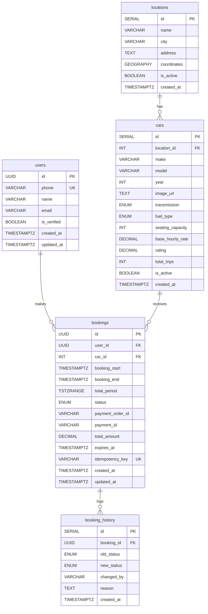

# ZoomCars - System Design Documentation

> **Version:** 1.0  
> **Last Updated:** February 2026  
> **Stack:** Next.js 14 + FastAPI + PostgreSQL + Redis

---

## Table of Contents

1. [System Overview](#1-system-overview)
2. [Architecture Diagram](#2-architecture-diagram)
3. [Database Schema](#3-database-schema)
4. [Redis Architecture](#4-redis-architecture)
5. [Search API Deep Dive](#5-search-api-deep-dive)
6. [Booking API Deep Dive](#6-booking-api-deep-dive)
7. [Key Design Decisions](#7-key-design-decisions)
8. [Additional Documentation](#8-additional-documentation)

---

## 1. System Overview

ZoomCars is a self-drive car rental platform designed for high availability and zero double-bookings. The architecture prioritizes:

- **Cache-first reads** - 0 DB hits when Redis cache is warm
- **Write-through caching** - DB writes update cache immediately
- **Redis-only holds** - No DB write until payment confirmation
- **PostgreSQL exclusion constraints** - Final safety net for double-booking prevention

### Tech Stack

| Layer      | Technology                                    |
| ---------- | --------------------------------------------- |
| Frontend   | Next.js 14 (App Router), TailwindCSS, Zustand |
| Backend    | FastAPI (Python 3.11+), SQLAlchemy 2.0        |
| Database   | PostgreSQL 15+ with PostGIS                   |
| Cache      | Redis 7+                                      |
| Auth       | JWT + OTP via Twilio WhatsApp                 |
| Payments   | Razorpay                                      |
| Deployment | Docker, AWS Lambda (Serverless)               |

---

## 2. Architecture Diagram

```
┌─────────────────────────────────────────────────────────────────────────────────┐
│                                   FRONTEND                                       │
│  ┌─────────────────────────────────────────────────────────────────────────┐    │
│  │                         Next.js 14 (App Router)                          │    │
│  │  ┌──────────────┐  ┌──────────────┐  ┌──────────────┐  ┌─────────────┐  │    │
│  │  │   Home Page  │  │  Search Page │  │ Booking Page │  │  Auth Store │  │    │
│  │  │              │  │  (filters,   │  │  (OTP flow,  │  │   (Zustand) │  │    │
│  │  │ SearchForm   │  │   results)   │  │   timer)     │  │             │  │    │
│  │  └──────────────┘  └──────────────┘  └──────────────┘  └─────────────┘  │    │
│  └─────────────────────────────────────────────────────────────────────────┘    │
└─────────────────────────────────────────────────────────────────────────────────┘
                                        │
                                        │ HTTPS (axios)
                                        ▼
┌─────────────────────────────────────────────────────────────────────────────────┐
│                              BACKEND (FastAPI)                                   │
│  ┌─────────────────────────────────────────────────────────────────────────┐    │
│  │                            API Gateway                                   │    │
│  │            /api/v1/auth  |  /api/v1/cars  |  /api/v1/bookings           │    │
│  └─────────────────────────────────────────────────────────────────────────┘    │
│                     │                    │                    │                  │
│                     ▼                    ▼                    ▼                  │
│  ┌────────────────────┐  ┌────────────────────┐  ┌────────────────────────┐     │
│  │    Auth Router     │  │    Cars Router     │  │   Bookings Router      │     │
│  │  - send-otp        │  │  - /search         │  │  - /initiate (hold)    │     │
│  │  - verify-otp      │  │  - /{id}           │  │  - /confirm (write DB) │     │
│  │  - me              │  │  - /{id}/available │  │  - /cancel             │     │
│  └────────────────────┘  └────────────────────┘  └────────────────────────┘     │
│             │                       │                        │                   │
│             └───────────────────────┼────────────────────────┘                   │
│                                     │                                            │
│                     ┌───────────────┴───────────────┐                            │
│                     ▼                               ▼                            │
│  ┌─────────────────────────────┐    ┌─────────────────────────────┐             │
│  │         REDIS               │    │       POSTGRESQL            │             │
│  │  - City locations cache     │    │  - users                    │             │
│  │  - Location cars cache      │    │  - locations                │             │
│  │  - Car schedules cache      │    │  - cars                     │             │
│  │  - Active holds (TTL)       │    │  - bookings                 │             │
│  │  - OTP storage (5 min)      │    │  - booking_history          │             │
│  │  - Distributed locks        │    │                             │             │
│  │  - Rate limiting            │    │  Exclusion Constraint:      │             │
│  │                             │    │  no_double_booking          │             │
│  └─────────────────────────────┘    └─────────────────────────────┘             │
└─────────────────────────────────────────────────────────────────────────────────┘
                                        │
                                        ▼
                        ┌───────────────────────────────┐
                        │     External Services         │
                        │  - Twilio (WhatsApp OTP)      │
                        │                               │
                        └───────────────────────────────┘
```

---

## 3. Database Schema

### Entity Relationship Diagram



### Table Details

#### `users`

- Primary user table with phone-based authentication
- `phone` is unique and indexed for fast OTP lookups

#### `locations`

- Car pickup/drop-off hubs across cities
- Uses PostGIS `GEOGRAPHY` type for coordinates
- GiST index on coordinates for fast geo queries

#### `cars`

- Vehicles available for rent
- FK to `locations` (car belongs to one hub)
- Indexed by location, transmission, fuel_type, and rate

#### `bookings`

- **Critical table** with double-booking prevention
- `total_period` is a `TSTZRANGE` including 1-hour buffer after drop-off
- **Exclusion constraint** prevents overlapping CONFIRMED/PENDING bookings:

```sql
CONSTRAINT no_double_booking EXCLUDE USING GIST (
    car_id WITH =,
    total_period WITH &&
) WHERE (status IN ('CONFIRMED', 'PENDING'))
```

#### `booking_history`

- Audit log for booking status changes
- Populated via trigger on bookings table

### Key Indexes

| Table     | Index                        | Purpose                    |
| --------- | ---------------------------- | -------------------------- |
| locations | `idx_locations_geo` (GiST)   | Fast geo-spatial queries   |
| cars      | `idx_cars_location`          | Filter cars by location    |
| bookings  | `idx_bookings_period` (GiST) | Range overlap queries      |
| bookings  | `idx_bookings_idempotency`   | Prevent duplicate requests |

---

## 4. Redis Architecture

Redis serves as both a **cache layer** and **distributed state store** for the application.

### Key Patterns & TTLs

```
┌─────────────────────────────────────────────────────────────────────────────┐
│                            REDIS KEY STRUCTURE                               │
├─────────────────────────────────────────────────────────────────────────────┤
│                                                                              │
│  CACHING LAYER (Read Performance)                                           │
│  ─────────────────────────────────                                          │
│  locations:city:{city}          → [locations...]       TTL: 24 hours        │
│  cars:location:{location_id}    → [cars...]            TTL: 1 hour          │
│  car:schedule:{car_id}          → [bookings...]        TTL: 1 hour          │
│                                   (expired entries auto-filtered)            │
│                                                                              │
│  BOOKING HOLDS (Distributed State)                                          │
│  ─────────────────────────────────                                          │
│  hold:{booking_id}              → {hold_data}          TTL: 5 minutes       │
│  car:holds:{car_id}             → SET[booking_ids]     TTL: 1 hour          │
│                                                                              │
│  AUTHENTICATION                                                              │
│  ─────────────────────────────────                                          │
│  user:otp:{phone}               → "123456"             TTL: 5 minutes       │
│  otp_rate_limit:{phone}         → count                TTL: 1 hour          │
│                                                                              │
│  DISTRIBUTED LOCKING                                                        │
│  ─────────────────────────────────                                          │
│  booking:lock:{car_id}          → lock_token           TTL: 30 seconds      │
│                                                                              │
│  IDEMPOTENCY                                                                 │
│  ─────────────────────────────────                                          │
│  idempotency:{key}              → {response}           TTL: 10 minutes      │
│                                                                              │
└─────────────────────────────────────────────────────────────────────────────┘
```

### Role of Redis in Each Flow

| Flow                   | Redis Role                       | Benefit                   |
| ---------------------- | -------------------------------- | ------------------------- |
| **Search**             | Cache locations, cars, schedules | 0 DB hits when warm       |
| **Initiate Booking**   | Store hold, OTP, acquire lock    | No DB write until confirm |
| **Confirm Booking**    | Validate hold + OTP, cleanup     | Fast validation           |
| **Availability Check** | Check schedule + active holds    | Real-time accuracy        |

### Hold Management (Two-Key Architecture)

```
When user initiates booking:

1. hold:{booking_id}           → Full hold data (JSON)
   - car_id, phone, start, end, lock_token, expires_at
   - TTL: 5 minutes (auto-expires if abandoned)

2. car:holds:{car_id}          → SET of active booking_ids
   - Used for fast availability checks
   - Members cleaned up lazily when hold TTL expires
```

This design enables:

- **O(1)** hold lookup by booking_id
- **O(n)** availability check where n = active holds for a car (typically 0-2)
- **Auto-cleanup** via Redis TTL (no background jobs needed)

### Cache Safety Guarantees

The Redis cache implementation ensures data consistency through several mechanisms:

#### 1. No Partial Cache Creation

Schedule cache is only populated via full DB fetch - never partially:

```python
# add_booking_to_schedule() returns early if cache is cold
if not cache_exists:
    return  # Let next read populate from DB with full data
```

#### 2. Atomic Cache Updates (Lua Script)

When adding a booking to an existing schedule cache, a Lua script ensures atomicity:

```lua
local current = redis.call('GET', KEYS[1])
if not current then
    return 0  -- Cache doesn't exist, skip
end
local schedule = cjson.decode(current)
local new_booking = cjson.decode(ARGV[1])
table.insert(schedule, new_booking)
redis.call('SETEX', KEYS[1], ARGV[2], cjson.encode(schedule))
return 1
```

This prevents race conditions where concurrent requests could overwrite each other's updates.

#### 3. Expired Booking Filtering

Schedule cache automatically filters out expired bookings on both read and write:

```python
def _filter_expired_bookings(schedule: List[dict]) -> List[dict]:
    now = datetime.now(timezone.utc)
    return [
        b for b in schedule
        if datetime.fromisoformat(b["end"]) > now
    ]
```

This prevents stale entries from accumulating in long-lived caches.

#### 4. Write-Through Pattern

All DB writes immediately update the corresponding cache entry, ensuring consistency.

#### 5. DB Safety Net

PostgreSQL exclusion constraint (`no_double_booking`) acts as final safety net if cache issues occur.

---

## 5. Search API Deep Dive

**Endpoint:** `GET /api/v1/cars/search`

### Request Parameters

| Parameter    | Type     | Required | Description                      |
| ------------ | -------- | -------- | -------------------------------- |
| city         | string   | ✅       | City name (e.g., "Bangalore")    |
| lat          | float    | ✅       | User's latitude                  |
| lng          | float    | ✅       | User's longitude                 |
| start_time   | datetime | ✅       | Pickup time (ISO format)         |
| end_time     | datetime | ✅       | Drop-off time (ISO format)       |
| transmission | enum     | ❌       | MANUAL / AUTOMATIC               |
| fuel_type    | enum     | ❌       | PETROL / DIESEL / ELECTRIC / CNG |
| max_price    | float    | ❌       | Maximum hourly rate              |
| min_seats    | int      | ❌       | Minimum seating capacity         |
| limit        | int      | ❌       | Results per page (default: 20)   |
| offset       | int      | ❌       | Pagination offset                |

### Search Flow Architecture

```
┌─────────────────────────────────────────────────────────────────────────────┐
│                         SEARCH API FLOW                                      │
│                    (City-Based Caching - 0 DB Hits)                         │
└─────────────────────────────────────────────────────────────────────────────┘

       User Request
           │
           ▼
    ┌──────────────┐
    │  Validation  │  • start_time not in past
    │              │  • end_time > start_time
    │              │  • duration >= MIN_RENTAL_HOURS
    └──────┬───────┘
           │
           ▼
    ┌──────────────┐     Cache Miss?     ┌───────────────┐
    │ Step 1: Get  │─────────────────────▶│  PostgreSQL  │
    │  car         |                      |              |
    |   Locations  │     (rare)          │  SELECT from  │
    │  for City    │◀────────────────────│  locations    │
    │              │     Write-through   └───────────────┘
    │  Redis Key:  │
    │  locations:  │
    │  city:mumbai │
    └──────┬───────┘
           │
           ▼
    ┌──────────────┐
    │ Step 2:      │  Haversine formula in Python
    │ Filter by    │  (no PostGIS query needed)
    │ Distance     │
    │              │  radius = 15km (configurable)
    └──────┬───────┘
           │
           ▼
    ┌──────────────┐     Cache Miss?     ┌───────────────┐
    │ Step 3: Get  │─────────────────────▶│  PostgreSQL   │
    │  Cars for    │     (batch)         │  SELECT from  │
    │  Locations   │◀────────────────────│  cars         │
    │              │     Write-through   └───────────────┘
    │  Redis MGET: │
    │  cars:loc:1  │
    │  cars:loc:2  │
    └──────┬───────┘
           │
           ▼
    ┌──────────────┐
    │ Step 4:      │  Apply in Python:
    │ Apply        │  • transmission filter
    │ Filters      │  • fuel_type filter
    │              │  • max_price filter
    │              │  • min_seats filter
    └──────┬───────┘
           │
           ▼
    ┌──────────────┐     Cache Miss?     ┌───────────────┐
    │ Step 5:      │─────────────────────▶│  PostgreSQL   │
    │ Check        │     (batch)         │  SELECT from  │
    │ Schedule     │◀────────────────────│  bookings     │
    │ Cache        │     Write-through   └───────────────┘
    │              │
    │  Redis MGET: │  Check for time overlap with
    │  car:sched:* │  CONFIRMED bookings only
    │              │  (expired entries auto-filtered)
    └──────┬───────┘
           │
           ▼
    ┌──────────────┐
    │ Step 6:      │  Check car:holds:{car_id} SETs
    │ Check Redis  │  for each available car
    │ Holds        │
    │              │  Filter out cars with overlapping holds
    │  (Pure Redis)│
    └──────┬───────┘
           │
           ▼
    ┌──────────────┐
    │ Step 7:      │  • Sort by distance, then price
    │ Sort &       │  • Apply pagination (offset/limit)
    │ Paginate     │  • Calculate dynamic pricing
    └──────┬───────┘
           │
           ▼
       Response
    { cars: [...], total_count: N }
```

### Dynamic Pricing Logic

```python
def calculate_dynamic_price(base_rate, start_time, duration_hours):
    price = base_rate

    # Weekend surge: +20% (Friday 6pm - Sunday midnight)
    if start_time.weekday() >= 4:
        price *= 1.2

    # Long-term discount: -15% for rentals > 7 days
    if duration_hours >= 168:
        price *= 0.85

    return round(price, 2)
```

---

## 6. Booking API Deep Dive

The booking flow uses a **two-phase commit** pattern with Redis holds:

1. **Initiate** - Creates hold in Redis, sends OTP (NO DB write)
2. **Confirm** - Validates OTP + lock_token, writes to DB

### Why This Design?

- **Zero abandoned booking pollution** - DB only has confirmed bookings
- **Fail-fast availability** - Redis check before locking
- **Auto-cleanup** - TTL handles expired holds
- **Idempotent confirms** - booking_id as idempotency key

### Complete Booking Flow

```
┌─────────────────────────────────────────────────────────────────────────────┐
│                      BOOKING FLOW (Two-Phase Commit)                         │
└─────────────────────────────────────────────────────────────────────────────┘

  PHASE 1: INITIATE (/bookings/initiate)
  ════════════════════════════════════════

  User: { car_id, phone, start_time, end_time }
           │
           ▼
    ┌──────────────┐
    │ Rate Limit   │  Check otp_rate_limit:{phone}
    │ Check        │  Max 3 OTPs per hour
    └──────┬───────┘
           │
           ▼
    ┌──────────────┐
    │ Validation   │  • Phone format
    │              │  • start < end
    │              │  • start not in past
    │              │  • duration >= 1 hour
    └──────┬───────┘
           │
           ▼
    ┌──────────────┐                   ┌───────────────┐
    │ Verify Car   │──────────────────▶│  PostgreSQL   │
    │ Exists       │                   │  (cars table) │
    └──────┬───────┘                   └───────────────┘
           │
           ▼
    ┌──────────────┐
    │ Fail-Fast    │  Check schedule cache + active holds
    │ Availability │  If unavailable → 409 Conflict
    │ (Pre-Lock)   │  (Avoids waiting for lock if slot taken)
    └──────┬───────┘
           │
           ▼
    ┌──────────────┐
    │ Acquire      │  Redis lock: booking:lock:{car_id}
    │ Distributed  │  TTL: 30 seconds
    │ Lock         │  If busy → 409 "Being booked by another user"
    └──────┬───────┘
           │
           ▼  (Inside Lock)
    ┌──────────────┐
    │ Re-Check     │  Verify availability again after lock
    │ Availability │  (Prevents race condition)
    └──────┬───────┘
           │
           ▼
    ┌──────────────┐
    │ Create Hold  │  Generate: booking_id (UUID), lock_token (UUID)
    │ in Redis     │
    │              │  Set: hold:{booking_id} → {full_hold_data}   TTL: 5min
    │  (NO DB!)    │  Add: car:holds:{car_id} ← booking_id
    └──────┬───────┘
           │
           ▼  (Release Lock)
    ┌──────────────┐
    │ Generate &   │  Store: user:otp:{phone} → "123456"   TTL: 5min
    │ Send OTP     │  Send via Twilio WhatsApp
    └──────┬───────┘
           │
           ▼
    Response: {
      booking_id,
      lock_token,      ← User must send this back to confirm
      expires_at,
      expires_in_seconds: 300,
      booking_preview: { car, duration, total_amount }
    }


  PHASE 2: CONFIRM (/bookings/confirm)
  ════════════════════════════════════

  User: { booking_id, lock_token, otp, name?, email? }
           │
           ▼
    ┌──────────────┐
    │ Fetch Hold   │  Get hold:{booking_id} from Redis
    │              │  If not found → 400 "Hold expired"
    └──────┬───────┘
           │
           ▼
    ┌──────────────┐
    │ Validate     │  Compare request.lock_token with hold.lock_token
    │ Lock Token   │  If mismatch → 403 "Invalid lock token"
    └──────┬───────┘
           │
           ▼
    ┌──────────────┐
    │ Verify OTP   │  Get user:otp:{phone} from Redis
    │              │  Compare with request.otp
    │              │  If invalid → 400 "Invalid OTP"
    └──────┬───────┘
           │
           ▼
    ┌──────────────┐                   ┌───────────────┐
    │ Get/Create   │──────────────────▶│  PostgreSQL   │
    │ User         │                   │ INSERT/SELECT │
    │              │                   │  users table  │
    └──────┬───────┘                   └───────────────┘
           │
           ▼
    ┌──────────────────────────────────────────────────┐
    │ INSERT CONFIRMED Booking                          │
    │                                                   │
    │  INSERT INTO bookings (                           │
    │    id, user_id, car_id, booking_start, end,       │
    │    total_period, status='CONFIRMED', ...          │
    │  )                                                │
    │                                                   │
    │  ┌─────────────────────────────────────────────┐  │
    │  │  EXCLUSION CONSTRAINT: no_double_booking    │  │
    │  │  If violated → 409 "Slot just taken"        │  │
    │  │  (Edge case: another booking snuck in)      │  │
    │  └─────────────────────────────────────────────┘  │
    └──────────────────────────────────────────────────┘
           │
           ▼
    ┌──────────────┐
    │ Cleanup      │  • Delete hold:{booking_id}
    │ Redis        │  • Remove from car:holds:{car_id}
    │              │  • Delete user:otp:{phone}
    │              │  • Atomically append to car:schedule:{car_id}
    │  (Lua script)│    (using atomic Lua script)
    └──────┬───────┘
           │
           ▼
    Response: {
      booking_id,
      status: "CONFIRMED",
      car: { make, model, year, location },
      booking: { start, end, total_amount }
    }
```

### Lock Token Security

The `lock_token` provides security against:

- **Replay attacks** - Token is single-use, tied to booking_id
- **Session hijacking** - Token is random UUID, not guessable
- **Unauthorized confirms** - Must match what was returned by initiate

### Buffer Time Handling

```
User books: 10:00 AM - 2:00 PM (4 hours)

Actual blocked time in DB:
  total_period = [10:00 AM, 3:00 PM)   ← 1-hour buffer for cleaning

This prevents:
  - Next user booking 2:00 PM - 6:00 PM ✓ (conflicts with 2-3 PM buffer)
  - Next user booking 3:00 PM - 6:00 PM ✓ (no conflict)
```

---

## 7. Key Design Decisions

### 7.1 Why Redis-Only Holds (No PENDING in DB)?

| Approach                 | Pros                                 | Cons                                                 |
| ------------------------ | ------------------------------------ | ---------------------------------------------------- |
| **DB PENDING rows**      | Simple                               | Pollution from abandoned bookings, need cleanup jobs |
| **Redis holds (chosen)** | Zero pollution, auto-cleanup via TTL | Slightly more complex flow                           |

### 7.2 Why Distributed Lock Per Car?

```
Without lock:
  User A: Check available → ✓
  User B: Check available → ✓
  User A: Create hold → ✓
  User B: Create hold → ✓  ← DOUBLE HOLD!

With lock (booking:lock:{car_id}):
  User A: Acquire lock → ✓, Check → ✓, Create hold → ✓, Release
  User B: Acquire lock → (waits)
  User B: Check → ✗ (blocked by User A's hold)
```

### 7.3 Why Two-Key Hold Architecture?

```
Single-key (hold:{booking_id}):
  ❌ To check availability, must SCAN all hold:* keys
  ❌ O(n) where n = all active holds across ALL cars

Two-key (hold:{booking_id} + car:holds:{car_id}):
  ✓ O(1) to get set of hold IDs for a specific car
  ✓ O(m) where m = holds for THIS car (typically 0-2)
```

### 7.4 Why PostgreSQL Exclusion Constraint?

The exclusion constraint is the **final safety net**:

```sql
CONSTRAINT no_double_booking EXCLUDE USING GIST (
    car_id WITH =,
    total_period WITH &&
) WHERE (status IN ('CONFIRMED', 'PENDING'))
```

This catches edge cases that slip through Redis:

- Redis restart during booking
- Clock skew between servers
- Rare race conditions

**Cost:** Slight overhead on INSERT  
**Benefit:** Guaranteed data integrity

### 7.5 Cache Invalidation Strategy

| Event               | Cache Action                                              |
| ------------------- | --------------------------------------------------------- |
| Booking confirmed   | **Atomic append**: Lua script adds to `car:schedule:{id}` |
| Booking cancelled   | **Invalidate**: Delete `car:schedule:{id}`                |
| Car details updated | **Invalidate**: Delete `cars:location:{id}`               |
| Location added      | **Invalidate**: Delete `locations:city:{city}`            |

Most reads use **stale-while-revalidate** pattern - serve cache immediately, refresh in background.

### 7.6 Cache Consistency Guarantees

| Guarantee                     | Implementation                                        |
| ----------------------------- | ----------------------------------------------------- |
| **No partial cache**          | Only full DB fetch populates cache                    |
| **Atomic updates**            | Lua script for read-modify-write operations           |
| **No stale entries**          | Expired bookings filtered on read/write               |
| **Race condition prevention** | Atomic Lua script prevents concurrent overwrites      |
| **Cold cache safety**         | Returns early if cache doesn't exist, forces DB fetch |

---

## 8. Additional Documentation

For detailed technical documentation, refer to:

- **[Load Analysis & Capacity Planning](docs/LOAD_ANALYSIS.md)** - Memory usage, system limits, scale recommendations
- **[System Design](docs/SYSTEM_DESIGN.md)** - Deep technical architecture (if available)
- **[Search Architecture](docs/SEARCH_ARCHITECTURE.md)** - Cache-first search implementation details (if available)

---

## Appendix: Configuration Reference

```python
# Business Rules
MIN_RENTAL_HOURS = 1
BUFFER_HOURS = 1.0
SEARCH_RADIUS_METERS = 15000

# Redis TTLs
TTL_HOLD = 300              # 5 minutes
TTL_OTP = 300               # 5 minutes
TTL_CITY_LOCATIONS = 86400  # 24 hours
TTL_LOCATION_CARS = 3600    # 1 hour
TTL_CAR_SCHEDULE = 3600     # 1 hour
TTL_BOOKING_LOCK = 30       # 30 seconds

# Rate Limits
OTP_RATE_LIMIT_HOUR = 3     # Max 3 OTPs per phone per hour
```
